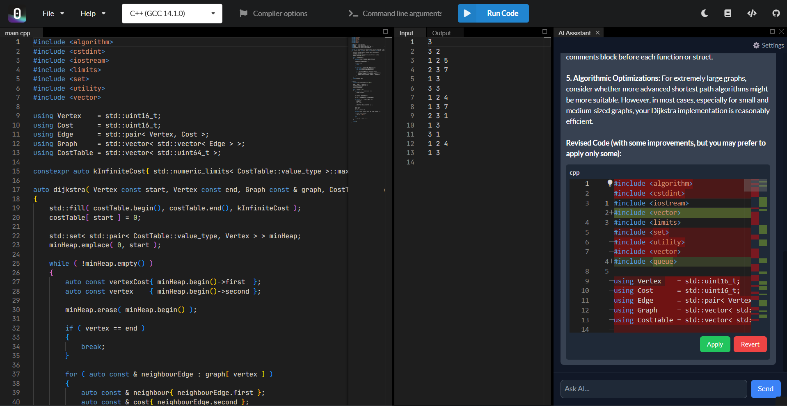

<!-- ABOUT THE PROJECT -->
## About The Project
AI Code Editor is an **AI-powered developer tool** designed for **fast-paced startup environments**. It integrates **LLMs to assist with debugging, code generation, and execution analysis**, making it an ideal companion for software engineers.


### 🌟 **Why This Project Stands Out** 
- 🚀 **AI-Powered Development** – Assists in **error detection**, **code explanations**, and **optimizations**. 
- 🛠 **Real-Time Execution** – Uses **Open-Source Judge0 API** to run code inside the editor. 
- 🌐 **Startup-Ready** – Deployable on **Vercel**, lightweight, and optimized for **remote collaboration**.

### Built With
* [](#)
* [](#)
* [](#)
* [](#)
* [](#)
* [](#)


<!-- GETTING STARTED -->
## Getting Started
To get the project running locally, follow these steps:

### Prerequisites
- **Node.js** (`v16+`) 
-  **Git** installed 
- API key from **OpenRouter.ai**

### Installation

1. Get a free API Key at [https://openrouter.ai/](https://openrouter.ai/)
2. Clone the repo
   ```sh
   git clone https://github.com/rgopalan01/AI-Code-Editor.git
   cd AI-Code-Editor 
   ```
3. Install dependencies
   ```sh
   npm install
   ```
4. Run the development server
   ```sh
   npm run dev
   ```
5. open `http://localhost:3000` in your browser.


<!-- USAGE EXAMPLES -->
## Usage

1. Select a programming language
2. Write your code in the Monaco-powered editor
3. Click "Run Code" to execute via Judge0 API
4. Use the AI Assistant to get:
    -   Error explanations
    -   Code optimizations
    -   Debugging insights

<!-- ROADMAP -->
## Roadmap
- [ ] AI-Powered Debugging: Automatic  Error Detection
- [ ] Code Autocomplete
- [ ] Multi-Model Support
	- [X] Gemini-Flash-1.5
    - [ ] DeepSeek-V3
    - [ ] Claude 3.5 Sonnet
